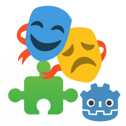
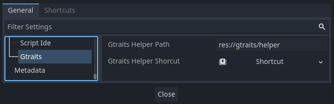
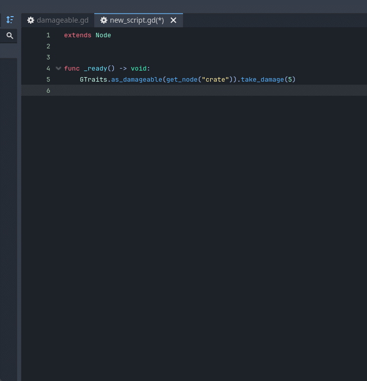
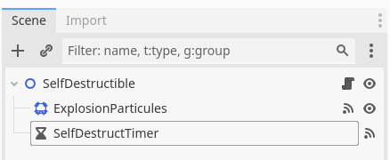
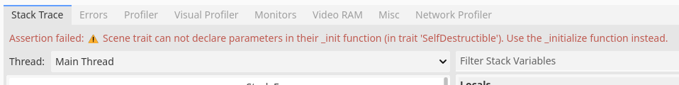
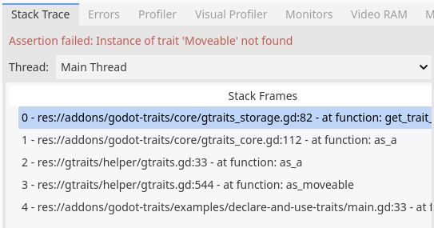
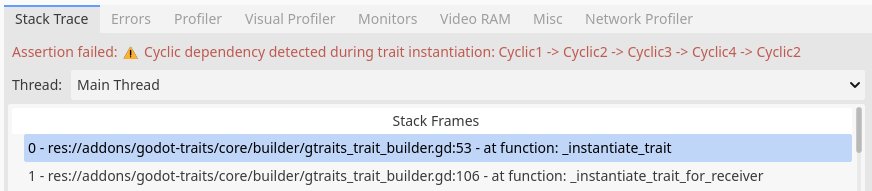
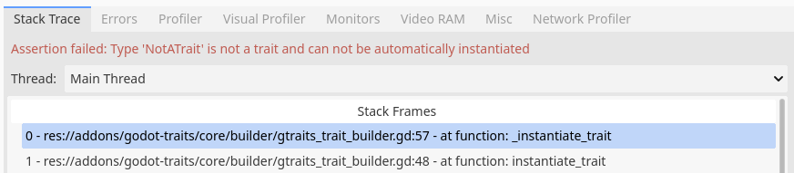

[](https://discord.gg/SWg6vgcw3F)

# Godot Traits

Traits made easy in [Godot Engine](https://godotengine.org/).



## 📖 Godot Traits in a nutshell

Godot Traits is an addon designed to bring traits into GDScript. A _trait_ embodies a collection of behaviors (variables, functions, signals, etc.) that can be utilized to extend the functionalities of a class.

Given that Godot Engine lacks an official interface system, many developers resort to composition for combining various behaviors in a single class. However, implementing composition correctly can become complex and inconsistent. This addon's goal is to offer a streamlined and accessible approach for adding and removing behaviors from objects in Godot. This is achieved by defining trait classes and attaching them to objects, and using auto-generated utilities to use them.

## 🗺️ Roadmap

- [x] Core trait system
- [x] Automatic multi trait dependencies injection 
- [x] Automatic dependent trait declaration and creation
- [x] Generation of an helper script to provide strong typed features and code completion in editor
- [ ] Inline traits into scripts by using the `@inline_trait(TheTraitName)` annotation
- [x] Helper methods to invoke code if object _is a [something]_ or else invoke a _fallback method_
- [ ] Trait instantiation optimization (keep trait instantiation info in memory for future usage)
- [ ] When removing a trait, also remove its dependencies if not used by other object traits
 
## 📄 Examples

Many usage examples are available in `addons/godot-traits/examples` folders. Each example has its proper `README` file explaining the example concept.

## 📄 Features

| __In-editor__                                              	                                                             | __Runtime__                                	                                         |
|----------------------------------------------------------------------------------------------------------------------------|---------------------------------------------------------------------------------------|
| 🔑 [Trait declaration using annotation](#-trait-declaration-using-annotation)                     	                    | 🔑 [Trait instance automatic lifecycle](#-trait-instance-automatic-lifecycle)         |
| 🔑 [Auto-generated trait helper class to manipulate traits](#-auto-generated-trait-helper-class-to-manipulate-traits)     | 🔑 [Scene as trait](#-scene-as-trait)                                                 |
| 🔑 [Strongly-typed traits and autocompletion](#-strongly-typed-traits-and-autocompletion)               	                | 🔑 [Dynamic addition and removal of traits](#-dynamic-addition-and-removal-of-traits) |
|                                                                                                                            | 🔑 [Automatic trait dependencies injection](#-automatic-trait-dependencies-injection) |
|                                                                                                                            | 🔑 [Traits inheritance](#-traits-inheritance)                                         |
|                                                                                                                            | 🔑 [Strong trait usage runtime checks](#-strong-trait-usage-runtime-checks)           |

### ➡️ In-editor features

#### 🔑 Trait declaration using annotation

_Godot Traits_ enables the definition of traits using the powerful class system of Godot Engine. Consequently, traits can encompass variables, functions, signals, call static functions, and more!

To distinguish your classes containing game logic from traits, _Godot Traits_ employs an annotation-like system. Given that it's not feasible to create new annotations in GDScript, _Godot Traits_ annotations are established within comments, as illustrated below:

```gdscript
# @annotation
# @annotation(param1=value1,param2=value2)
```

Declaring a trait is an exceptionally straightforward task:
```gdscript
#####
# File damageable.gd
#####

# @trait
class_name Damageable
extends Node

func take_damage(damage:int) -> void:
    pass
```

_And voilà !_ Your first trait is created. Traits can any class, regardless of the level of class nesting. This includes both the _top-level_ class (declared using the `class_name` keyword) and any _nested_ class (declared using the `class` keyword).

The higher the nesting level, the lengthier the trait invocation statement becomes, as invoking a trait necessitates unique identification of the class throughout all levels. To circumvent this issue, it's possible to declare an alias for the trait, such as a brief name, making it more convenient for use in the code.

```gdscript
#####
# File traits.gd
#####

class_name Traits

class SomeClass:

    # @trait
    class Damageable:
        pass

    # @trait(alias=Killable)
    class Killable:
        pass

# Damageable trait will be usable through Traits.SomeClass.Damageable reference
# Killable trait will be usable through Killable reference due to alias declaration
```

##### 📜 Trait declaration rules

- the `@trait` annotation comment must immediately precede the class declaration to be valid,
- annotations parameters must be declared between parenthesis, right after the `@trait` annotation. Parameters are separated by the `,` character, and parameter key and value are separated by the `=` character,
- if a script declares traits in _nested_ classes without declaring a _top level_ class, those traits will only be available in this script since those classes can be considered as _private_. The auto-generated class helper will not generate helper methods for those traits as they are _private_. See ___Auto-generated trait helper class to manipulate traits___ paragraph for more details.

#### 🔑 Auto-generated trait helper class to manipulate traits

_Godot Traits_ includes a code generation tool that offers helper methods for declaring and utilizing traits. This tool actively monitors trait declarations and modifications, automatically generating a `GDScript` file named `gtraits.gd` in a configurable folder.

Through this utility script, manipulating traits becomes easy and straightforward. It comprises four generic helper methods and four specific helper methods for each declared trait. For a trait named `Damageable`, the six methods are as follows:
- `set_damageable(object:Object) -> Damageable`: Applies the specified trait to make an object _Damageable_,
- `is_damageable(object:Object) -> bool`: Checks if an object possesses the _Damageable_ trait,
- `as_damageable(object:Object) -> Damageable`: Retrieves the _Damageable_ trait from the given object. This raises an error (in the form of a failed assertion) if the object _is not Damageable_,
- `if_is_damageable(object:Object, if_callable:Callable, deferred_call:bool = false) -> Variant`: Invoke the `if_callable` function on the object's _Damageable_ trait only if the object possesses the _Damageable_ trait. The `if_callable` function accepts only one argument: the _Damageable_ trait. The returned value is the callable result. If `deferred_call` is `true`, the callable is called using `call_deferred` method and the function returns `null`,
- `if_is_damageable_or_else(object:Object, if_callable:Callable, else_callable:Callable, deferred_call:bool = false) -> Variant`: Invoke the `if_callable` function on the object's _Damageable_ trait only if the object possesses the _Damageable_ trait, or else invoke the `else_callable` callable. The `if_callable` function accepts only one argument: the _Damageable_ trait, and the `else_callable` takes no argument. The returned value is the callable result. If `deferred_call` is `true`, the callable is called using `call_deferred` method and the function returns `null`,
- `unset_damageable(object:Object) -> void`: removes the _Damageable_ trait from the object.

```gdscript
#####
# File damageable.gd
#####

# @trait
class_name Damageable

func take_damage(damage:int) -> void:
    pass

#####
# File world.gd
#####
extends Node2D

# #####
# GTraits class contains damageable helpers since Godot Traits has automatically found the Damageable trait.
# So we can write the following code
# #####

func _ready() -> void:
    var crate:Node2D = preload("crate.tscn").instantiate()
    add_child(crate)
    GTraits.set_damageable(crate)
    crate.on_hit.connect(_on_crate_hit)

func _on_crate_hit() -> void:
    var crate:Node2D = get_node("crate")
    if GTraits.is_damageable(crate):
        GTraits.as_damageable(crate).take_damage(10)
    # Can also be rewrite as follow
    GTraits.if_is_damageable(crate, func(obj:Damageable): obj.take_damage(10))
    # Can also be rewrite as follow
    GTraits.if_is_damageable_or_else(
        crate, 
        func(obj:Damageable): obj.take_damage(10),
        func(): print("I'm invicible!")
    )
    # Finally, can unset damageable trait
    GTraits.unset_damageable(crate)
```

_Godot Traits_ generation tool can also generate helper methods for _nested_ trait classes. As _nested_ class names may not be unique across the project and to prevent generating the same helper method twice, the generation tool utilizes the trait's _parent classes_ as context to create a unique helper name.

```gdscript
#####
# File traits.gd
#####

class_name Traits

class SomeClass:

    # @trait
    class Damageable:
        pass

# @trait
class Killable:
    pass

# Will automatically generates helpers methods:
# set_traits_some_class_damageable, is_traits_some_class_damageable, as_traits_some_class_damageable, unset_traits_some_class_damageable, if_is_traits_some_class_damageable, if_is_traits_some_class_damageable_or_else
# set_traits_killable, is_traits_killable, as_traits_killable, unset_traits_killable, if_is_traits_killable, if_is_traits_killable_or_else
```

_Godot Traits_ generation tool honors the _alias_ trait annotation parameter by creating helper methods named according to the specified alias.

```gdscript
#####
# File damageable.gd
#####

# @trait
class_name Damageable

func take_damage(damage:int) -> void:
    print("Take %s damages!" % _compute_damage(damage))

func _compute_damage(initial_damage:int) -> int:
    return initial_damage

# @trait(alias=CriticalDamageable)
class CriticalDamageable extends Damageable:
    func _compute_damage(initial_damage:int) -> int:
        return initial_damage * 2

# Will automatically generates helpers methods:
# set_critical_damageable, is_critical_damageable, as_critical_damageable, unset_critical_damageable, if_is_critical_damageable, if_is_critical_damageable_or_else
# instead of creating those helpers methods:
# set_damageable_critical_damageable, ...
```

##### 📜 Auto-generated trait helper rules

- The generated `GTraits` script file can be safely committed to your _Version Control System_ (VCS),
- It is highly recommended not to make modifications in the generated `GTraits` script file, as these changes will be overwritten the next time the script is generated,
- _Godot Traits_ Code generation is customizable: its settings can be accessed through the _Editor > Editor Settings_ menu, under _GTraits_ section:
  - The _GTraits Helper Path_ represents the folder path where the `GTraits` script will be generated,
  - The _GTraits Helper Shortcut_ is a key combination that triggers a complete regeneration of the `GTraits` script by scanning all resources from `res://` folder.



- Nothing can prevent declaring the same trait _alias_ multiples times for various traits. Consequently, the _alias_ will be utilized for the helper methods of the first encountered trait, while helper methods for other traits will be generated as if there were no _alias_. A warning will be displayed in the _Godot Editor_ console.

#### 🔑 Strongly-typed traits and autocompletion

With its code generation tool, _Godot Traits_ makes it easier to write code. The generated helper methods are indeed strongly typed, providing developers with the advantages of both _strong-typed code safety_ and _code completion_, in contrast of duck typing.

_Examples of code completion and code navigation facilitated by the static typing introduced by `GTraits`_





### ➡️ Runtime features

#### 🔑 Trait instance automatic lifecycle

##### Instantiation

_Godot Traits_ will automatically apply operations on instantiated traits depending on their type. 

- For _object_ traits (traits that extend `Object` or `RefCounted`), no special applied operation is performed,
- For _node_ traits (traits that extend `Node` or any sub-classes of `Node`), trait instances are automatically added as _child of the receiver_. The trait instance is added as an _internal node_, so it's not possible to retrieve it unless specifying the `include_internal` parameter in retrieval functions.

##### Removal

_Godot Traits_ will automatically free trait instance upon removal
- For _object_ traits (traits that extend `Object`), the `free` function is immediatly called,
- For _ref counted_ traits (traits that extend `RefCounted`), no function is called since those objects are automatically garbage collected,
- For _node_ traits (traits that extend `Node` or any sub-classes of `Node`), the `queue_free` function is called immediatly.

###### 📜 Trait instance automatic lifecycle rules

- ⚠️ _Godot Traits limitation_: when removing a trait from an object, only the trait instance itself is removed and freed from memory. Trait dependencies are still declared in the object. They should be removed manually, if needed. See [Roadmap](#%EF%B8%8F-roadmap) for more information.

#### 🔑 Scene as trait

As _Godot_ is a _node-oriented_ game engine, it is typical to share behavioral components using scenes, such as a hitbox, animations, or a movement controller. With _Godot Traits_, developers can create intricate traits that extend beyond simple scripts and encompass entire scenes. Any scene with its _root script_ (the script attached to the root node of the scene) defined as a trait is identified as a _scene trait_ and can be utilized just like any other traits.




```gdscript
#####
# File sef_destructible.gd
#####

# @trait
class_name SelfDestructible
extends Node2D

signal after_destruction

@onready var _explosion_particules: CPUParticles2D = $ExplosionParticules
@onready var _self_desctruct_timer: Timer = $SelfDestructTimer

var _receiver
var _logger:Loggable

func _initialize(receiver, logger: Loggable) -> void:
    _receiver = receiver
    _logger = logger

func _on_self_desctruct_timer_timeout() -> void:
    _explosion_particules.emitting = true
    get_tree().create_tween().tween_property(_receiver, "modulate:a", 0, _self_desctruct_timer.wait_time / 2)

func _on_explosion_particules_finished() -> void:
    after_destruction.emit()
```

```gdscript
#####
# File main.gd
#####

extends Node2D

@onready var _heart: Polygon2D = $Heart

func _ready() -> void:
    GTraits.set_self_destructible(_heart) \
        .after_destruction.connect(func(): _heart.queue_free())
```

Take note of the usage of the `_initialize` function in the self-destructible trait. This method is recognized by _Godot Traits_ and is automatically invoked after the instantiation of a scene trait to execute dependency injection. The `_init` function in _Godot_ cannot be utilized for dependency injection in scene traits as it cannot accept any arguments.

###### 📜 Scene as trait rules

- `_init` and `_initialize` functions can coexist within a scene trait, provided that the `_init` function does not take any arguments. In the event that it does, an assertion error will be triggered.



#### 🔑 Strong trait usage runtime checks

As developers, we often make strong assumptions about the objects we have, such as the type of node we expect in a callback (_it's always a car!_ for example). However, how can we ensure that we receive what we intended to receive? Most callback methods simply return objects of type `Node`. _Duck typing_ has its limitations when it comes to debugging your application (_if my object has the `kill` method, then call it, but what happens if it does not have the `kill` method? No error!_).

_Godot Traits_ provides helpers to retrieve object traits with robust checks: if the trait is not available, an assertion error is triggered, and the _Godot Engine_ debugger stops at the erroneous frame. There is no need to write boilerplate code for complicated checks anymore!

```gdscript
#####
# File world.gd
#####

extends Node2D

func _ready() -> void:
    var npc = preload("npc.gd").new()
    GTraits.set_killable(npc) # Out NPC can now be killed !
    GTraits.as_moveable(npc).move(Vector2.RIGHT) # Will raise an exception since the NPC is not Moveable !
```



#### 🔑 Dynamic addition and removal of traits

_Godot Traits_ enables dynamic addition or removal of traits to any object at runtime. This allows for the conditional activation of specific behavior without the need to maintain a state that must be accessible from everywhere.

```gdscript
#####
# File crate.gd
#####

class_name Crate
extends Node2D

func _init() -> void:
    # Add Damageable trait to this crate
    # This allows to call take_damage on this crate right after its creation
    GTraits.set_damageable(self)


#####
# File world.gd
#####

extends Node2D

func _ellapsed_time:float

func _process(delta:float) -> void:
    _ellapsed_time += delta

    var crate = get_node("crate")

    # Is always safe since we check if the trait is still available on the crate. No 
    # needs maintain an internal crate state saying it's invicible or not
    if GTraits.is_damageable(crate):
        GTraits.as_damageable(crate).take_damage(1)
    
    # Make the crate invicible after 10 seconds: it will no longer take damages
    if _ellapsed_time >= 10:
        GTraits.unset_damageable(crate)
```

#### 🔑 Automatic trait dependencies injection

Traits may depend on each other to function, or they may require a _receiver object_ (the trait carrier) to implement a specific behavior. For instance, a _Damageable_ trait would likely need a _Healthable_ object to deduct health from when damage is taken. It may also requires a _Loggable_ trait to do some debug prints.

_Godot Traits_ provides automatic injection of trait dependencies into trait constructors. If a trait constructor requests an object of the same type as the _trait receiver_ (or no specific type), the _receiver_ is automatically injected into the trait. If the trait constructor requires other traits, thoses traits will be retrieved from the _trait receiver_ itself. If some traits can not be resolved in the _receiver_, they are automatically (recursively) instantiated, registered into the _trait receiver_ for future usage, and injected into the instantiating trait.

```gdscript
#####
# File damageable.gd
#####

# @trait
class_name Damageable

var _receiver

# This trait needs a context to work (an object to remove health from)
# Since there is no asked type, it will be the trait receiver
func _init(the_receiver) -> void:
    _receiver = the_receiver

func take_damage(damage:int) -> void:
    _receiver.health -= damage

#####
# File world.gd
#####
extends Node2D

func _init() -> void:
    var crate:Node2D = preload("crate.tscn").instantiate()
    # This will automatically make the crate to be the receiver of the Damageable trait that is beeing added
    GTraits.set_damageable(crate)
```

If the trait constructor requests an object of a different type than the _receiver_ type, then _Godot Traits_ will examine the _receiver_ to locate a trait with that type and inject it into the trait constructor.

```gdscript
#####
# File damageable.gd
#####

# @trait
class_name Damageable

var _healthable:Healthable
var _loggable:Loggable

# This trait needs both Healthable (an object to remove health from) and Loggable (an object that is 
# able to print debug logs) to work. Healthable is also a trait. GTraits will check if the receiver
# object owns those traits, and automatically inject them intothis trait constructor.
# If the receiver does not have the required traits, they are automatically instantiated, registered into
# the receiver and injected into this trait.
func _init(the_healthable:Healthable, the_loggable:Loggable) -> void:
    _healthable = the_healthable
    _loggable = the_loggable

func take_damage(damage:int) -> void:
    _healthable.health -= damage
    _loggable.log("Took %d damage!" % damage)

#####
# File world.gd
#####
extends Node2D

func _init() -> void:
    var crate:Node2D = preload("crate.tscn").instantiate()
    # Only the Damageable trait is set initially
    # Now, when the Damageable trait is constructed, it automatically declares, creates,
    # and injects the required Healthable and Loggable traits into the crate
    GTraits.set_damageable(crate)
    assert(GTraits.is_damageable(crate), "It is Damageable !")
    assert(GTraits.is_loggable(crate), "It is Loggable too !")
    assert(GTraits.is_healthable(crate), "It is Healthable too !")
```

##### 📜 Automatic trait dependencies injection rules

- When automatically instantiating traits, developers need to be mindful of cyclic dependencies—cases where traits depend on each other. _Godot Traits_ cannot construct such traits due to the inherent cyclic structure. If encountered, an assertion error is raised, providing details about the cyclic dependency,



- The _auto-instantiation_ feature in _Godot Traits_ is limited to handling trait instances. If a trait's constructor demands an instance of a type that is not a trait, an assertion error will be raised. This limitation is essential as generic types may not adhere to trait rules and cannot be treated as such,



- The _auto-instantiation_ works with the _init_ function for basic traits. In _scene traits_, the `_init` function can not take arguments. To overcome this issue, _Godot Traits_ will look for the `_initialize` function for such traits. See [Scene as trait](#-scene-as-trait) section for more details
 
- Default arguments in trait constructors are not considered. 


#### 🔑 Traits inheritance

It's common to desire to specialize certain behavior using a sub-class. For instance, customizing code to manage critical damages is akin to taking damage, but the damage amount may differ.

_Godot Traits_ addresses this seamlessly! If a trait has been specialized and added to an object, it can be accessed seamlessly through its generic trait.

```gdscript
#####
# File damageable.gd
#####

# @trait
class_name Damageable

func take_damage(damage:float) -> void:
    var applied_damages:float = _compute_damages(damage)
    print("Damages : %s" % applied_damages)

func _compute_damages(initial_damage:float) -> float:
    return initial_damage

#####
# File critical_damageable.gd
#####

# @trait
class_name CriticalDamageable
extends Damageable

func _compute_damages(initial_damage:float) -> float:
    return initial_damage * 2

#####
# File crate.gd
#####

class_name Crate
extends Node2D

func _init() -> void:
    # This crate will only takes critical damages !
    GTraits.set_critical_damageable(self)

#####
# File world.gd
#####

extends Node2D

func _ready_() -> void:
    var crate = preload("crate.tscn").instantiate()

    # We can access to the trait using it's real type, this will print 50 damages !
    GTraits.as_critical_damageable(crate).take_damage(25)
    # But we also can access to the trait using it's parent type, this will also print 50 damages since GTraits call the CriticalDamageable trait !
    GTraits.as_damageable(crate).take_damage(25)
    # This is always true !
    assert(GTraits.as_critical_damageable(crate) == GTraits.as_damageable(crate))
```
