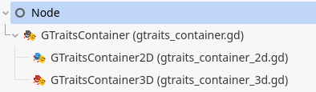
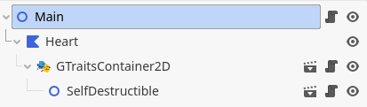

<p align="center">
    
</p>

[](https://discord.gg/SWg6vgcw3F)

A powerful trait system for [Godot Engine](https://godotengine.org/), making composition and behavior reuse effortless.

## 📖 Overview

Godot Traits is an addon that brings the power of traits to GDScript. A _trait_ represents a collection of behaviors (variables, functions, signals, etc.) that can be used to extend the functionality of any class.

While Godot Engine doesn't have a native interface system, developers often use composition to combine different behaviors in a single class. However, implementing composition correctly can be complex and inconsistent. This addon provides a streamlined and intuitive approach for adding and removing behaviors from objects in Godot by defining trait classes and attaching them to objects, with auto-generated utilities for easy usage.

## 🔧 Installation

1. Clone or download this repository
2. Copy the `addons/godot-traits` folder into your project's `addons` directory
3. Enable the plugin in Project Settings > Plugins
4. Restart the editor

## 📚 Common Use Cases

Godot Traits can be applied to various game development scenarios:

- **Component-based entities**: Create entity objects with multiple behavior traits
- **UI extensions**: Enhance UI nodes with reusable interaction traits
- **Game mechanics**: Implement reusable mechanics like health, inventory, or movement
- **AI behaviors**: Share AI routines across different enemy types
- **Plugin development**: Create traits that can be applied to any project node

## 🚀 Quick Start

Here's a simple example showing how to create and use traits:

```gdscript
#####
# File damageable.gd
#####

# @trait
class_name Damageable
extends Node

# This trait needs a Healthable object to manage health
var _healthable: Healthable

func _init(healthable: Healthable) -> void:
    _healthable = healthable

func take_damage(damage: int) -> void:
    _healthable.health -= damage
    print("Took %d damage!" % damage)

#####
# File healthable.gd
#####

# @trait
class_name Healthable
extends Node

var max_health: int = 100
var health: int = max_health

#####
# File crate.gd
#####

class_name Crate
extends Node2D

func _init() -> void:
    # Add Damageable trait to this crate
    # This allows us to call take_damage on this crate right after its creation
    GTraits.set_damageable(self)

#####
# File world.gd
#####

extends Node2D

func _ready() -> void:
    var crate: Node2D = preload("crate.tscn").instantiate()
    add_child(crate)

    # The Damageable trait will automatically get a Healthable trait
    # since it's required in its constructor
    assert(GTraits.is_damageable(crate), "Crate is damageable!")
    assert(GTraits.is_healthable(crate), "Crate has health!")

    # We can now damage the crate
    GTraits.as_damageable(crate).take_damage(10)
```

This example demonstrates:

- Trait declaration using the `@trait` annotation
- Automatic dependency injection (Damageable needs Healthable)
- Dynamic trait addition to objects
- Type-safe trait usage with code completion

## 🎯 Compatibility

The stable version (_1.x_) is compatible with Godot 4.4 and above. For users on older Godot Engine versions, the _0.x_ releases are available for manual download. If you need specific features not present in legacy versions, please feel free to open a backport request on our issue tracker.

## 📄 Examples

Comprehensive usage examples are available in the `addons/godot-traits/examples` folders. Each example includes a detailed `README` file explaining its concept.

## ✨ Features

Godot Traits provides a comprehensive set of features for trait-based programming in Godot:

|                                  **In-editor Features**                                   |                                 **Runtime Features**                                  |
| :---------------------------------------------------------------------------------------: | :-----------------------------------------------------------------------------------: |
|       🔑 [Trait declaration using annotation](#-trait-declaration-using-annotation)       |     🔑 [Trait instance automatic lifecycle](#-trait-instance-automatic-lifecycle)     |
|        🔑 [Auto-generated trait helper class](#-auto-generated-trait-helper-class)        |                         🔑 [Scene as trait](#-scene-as-trait)                         |
| 🔑 [Strongly-typed traits and autocompletion](#-strongly-typed-traits-and-autocompletion) |               🔑 [Dynamic trait management](#-dynamic-trait-management)               |
|                                                                                           | 🔑 [Automatic trait dependencies injection](#-automatic-trait-dependencies-injection) |
|                                                                                           |                     🔑 [Traits inheritance](#-traits-inheritance)                     |
|                                                                                           |      🔑 [Strong trait usage runtime checks](#-strong-trait-usage-runtime-checks)      |

### ➡️ In-editor Features

#### 🔑 Trait Declaration Using Annotation

Godot Traits enables trait definition using Godot's powerful class system. Traits can include variables, functions, signals, static functions, and more!

To distinguish game logic classes from traits, Godot Traits uses an annotation-like system. Since GDScript doesn't support custom annotations, Godot Traits annotations are defined within comments:

```gdscript
# @annotation
# @annotation(param1=value1,param2=value2)
```

Declaring a trait is straightforward:

```gdscript
#####
# File damageable.gd
#####

# @trait
class_name Damageable
extends Node

func take_damage(damage: int) -> void:
    pass
```

Traits can be declared at any class nesting level, including both top-level classes (using `class_name`) and nested classes (using `class`).

For nested classes, trait invocation statements can become lengthy as they require unique identification through all nesting levels. To address this, you can declare an alias for the trait:

```gdscript
#####
# File traits.gd
#####

class_name Traits

class SomeClass:
    # @trait
    class Damageable:
        pass

    # @trait(alias=Killable)
    class Killable:
        pass

# Damageable trait will be accessible via GTraits.SomeClass.Damageable
# Killable trait will be accessible directly via Killable due to alias
```

##### 📜 Trait Declaration Rules

- The `@trait` annotation comment must immediately precede the class declaration
- Annotation parameters must be declared between parentheses after the `@trait` annotation
- Parameters are separated by commas, with key-value pairs separated by `=`
- Traits declared in nested classes without a top-level class are considered private and only available within that script
- Private traits won't generate helper methods in the auto-generated class helper

#### 🔑 Auto-generated Trait Helper Class

Godot Traits includes a code generation tool that provides helper methods for trait management. This tool monitors trait declarations and modifications, automatically generating two GDScript files:

- `gtraits.gd`
- `gtraits_registry.gd` (automatically declared as `GTraitsRegistry` autoload in Project Settings)

The helper class provides four generic methods and four specific methods for each declared trait. For a `Damageable` trait, these methods are:

- `set_damageable(object: Object) -> Damageable`: Applies the Damageable trait to an object
- `is_damageable(object: Object) -> bool`: Checks if an object has the Damageable trait
- `as_damageable(object: Object) -> Damageable`: Retrieves the Damageable trait from an object (raises an assertion error if not found)
- `if_is_damageable(object: Object, if_callable: Callable, deferred_call: bool = false) -> Variant`: Executes code only if the object has the Damageable trait
- `if_is_damageable_or_else(object: Object, if_callable: Callable, else_callable: Callable, deferred_call: bool = false) -> Variant`: Executes code based on trait presence
- `unset_damageable(object: Object) -> void`: Removes the Damageable trait from an object

Example usage:

```gdscript
#####
# File world.gd
#####
extends Node2D

func _ready() -> void:
    var crate: Node2D = preload("crate.tscn").instantiate()
    add_child(crate)
    GTraits.set_damageable(crate)
    crate.on_hit.connect(_on_crate_hit)

func _on_crate_hit() -> void:
    var crate: Node2D = get_node("crate")
    if GTraits.is_damageable(crate):
        GTraits.as_damageable(crate).take_damage(10)
    # Alternative syntax:
    GTraits.if_is_damageable(crate, func(obj: Damageable): obj.take_damage(10))
    # With fallback:
    GTraits.if_is_damageable_or_else(
        crate,
        func(obj: Damageable): obj.take_damage(10),
        func(): print("I'm invincible!")
    )
    # Remove trait:
    GTraits.unset_damageable(crate)
```

##### 📜 Auto-generated Helper Rules

- Generated files (`gtraits.gd` and `gtraits_registry.gd`) can be safely committed to version control
- Avoid modifying generated files as changes will be overwritten on regeneration
- Code generation settings are available in Editor > Editor Settings > GTraits:
  - `GTraits Helper Path`: Folder path for generated scripts
  - `GTraits Helper Shortcut`: Key combination to trigger regeneration
- `GTraitsRegistry` autoload is automatically declared in Project Settings
  - Recommended to set it as the first autoload
- Trait aliases must be unique across the project
  - First encountered alias is used for helper methods
  - Subsequent traits with the same alias will generate standard helper names
  - A warning will be displayed in the editor console

#### 🔑 Strongly-typed Traits and Autocompletion

The code generation tool provides strongly-typed helper methods, offering both type safety and code completion benefits over duck typing.


### ➡️ Runtime Features

#### 🔑 Trait Instance Automatic Lifecycle

##### Instantiation

Godot Traits automatically handles trait instantiation based on type:

- Object traits (extending `Object` or `RefCounted`): No special operations
- Node traits (extending `Node` or its subclasses): Automatically added as a child of the receiver
  - Added as an internal node (not retrievable without `include_internal` parameter)

##### Removal

Godot Traits automatically manages trait cleanup:

- Object traits: Immediate `free()` call
- RefCounted traits: Automatic garbage collection
- Node traits: Immediate `queue_free()` call

###### 📜 Lifecycle Rules

- ⚠️ Current limitation: When removing a trait, only the trait instance is removed and freed
- Trait dependencies remain declared in the object
- Manual cleanup of unused dependencies may be needed
- See [Roadmap](#-roadmap) for future improvements

#### 🔑 Scene as Trait

Godot's node-oriented architecture often uses scenes for shared behaviors like hitboxes, animations, or movement controllers. Godot Traits supports scene-based traits, allowing complex behaviors that extend beyond simple scripts.


```gdscript
#####
# File self_destructible.gd
#####

# @trait
class_name SelfDestructible
extends Node2D

signal after_destruction

@onready var _explosion_particles: CPUParticles2D = $ExplosionParticles
@onready var _self_destruct_timer: Timer = $SelfDestructTimer

# The trait receiver
var _receiver
# The logger
var _logger: Loggable

func _initialize(receiver, logger: Loggable) -> void:
    _receiver = receiver
    _logger = logger

func _on_self_destruct_timer_timeout() -> void:
    _explosion_particles.emitting = true
    get_tree().create_tween().tween_property(_receiver, "modulate:a", 0, _self_destruct_timer.wait_time / 2)

func _on_explosion_particles_finished() -> void:
    after_destruction.emit()

#####
# File main.gd
#####

extends Node2D

@onready var _heart: Polygon2D = $Heart

func _ready() -> void:
    GTraits.set_self_destructible(_heart) \
        .after_destruction.connect(func(): _heart.queue_free())
```

Note the use of `_initialize` in the self-destructible trait. This method is recognized by Godot Traits and automatically called after scene trait instantiation for dependency injection. The `_init` function cannot be used for dependency injection in scene traits as it cannot accept arguments.

While this approach allows direct handling of scene traits from code, it limits the use of Godot Editor's built-in features like export variables. To address this, Godot Traits introduces trait container nodes, enabling trait declaration directly in the scene tree.



Containers can be added as children of any `Node`, making that node the receiver of all scene traits declared by the container. Scene traits can then be added as children of these containers.



###### 📜 Scene Trait Rules

- `_init` and `_initialize` functions can coexist in a scene trait
- `_init` must not take arguments (triggers assertion error if it does)
- `_initialize` is called after scene instantiation for dependency injection

#### 🔑 Strong Trait Usage Runtime Checks

Developers often make assumptions about object types in callbacks. While duck typing has limitations in debugging, Godot Traits provides robust trait retrieval with strong checks:

```gdscript
#####
# File world.gd
#####

extends Node2D

func _ready() -> void:
    var npc = preload("npc.gd").new()
    GTraits.set_killable(npc)
    GTraits.as_moveable(npc).move(Vector2.RIGHT) # Raises assertion error if not Moveable
```


#### 🔑 Dynamic Trait Management

Godot Traits enables dynamic addition and removal of traits at runtime, allowing conditional behavior activation without maintaining global state:

```gdscript
#####
# File crate.gd
#####

class_name Crate
extends Node2D

func _init() -> void:
    # Add Damageable trait to this crate
    # This allows to call take_damage on this crate right after its creation
    GTraits.set_damageable(self)

#####
# File world.gd
#####

extends Node2D

func _elapsed_time: float

func _process(delta: float) -> void:
    _elapsed_time += delta
    var crate = get_node("crate")

    # Is always safe since we check if the trait is still available on the crate. No
    # need to maintain an internal crate state saying it's invincible or not
    if GTraits.is_damageable(crate):
        GTraits.as_damageable(crate).take_damage(1)

    # Make the crate invincible after 10 seconds: it will no longer take damage
    if _elapsed_time >= 10:
        GTraits.unset_damageable(crate)
```

#### 🔑 Automatic Trait Dependencies Injection

Traits may depend on each other or require specific behaviors from their receiver. Godot Traits provides automatic dependency injection:

```gdscript
#####
# File damageable.gd
#####

# @trait
class_name Damageable

# This trait needs both Healthable (an object to remove health from) and Loggable (an object that is
# able to print debug logs) to work. Healthable is also a trait. GTraits will check if the receiver
# object owns those traits, and automatically inject them into this trait constructor.
# If the receiver does not have the required traits, they are automatically instantiated, registered into
# the receiver and injected into this trait.
var _healthable: Healthable
var _loggable: Loggable

func _init(healthable: Healthable, loggable: Loggable) -> void:
    _healthable = healthable
    _loggable = loggable

func take_damage(damage: int) -> void:
    _healthable.health -= damage
    _loggable.log("Took %d damage!" % damage)

#####
# File world.gd
#####

extends Node2D

func _init() -> void:
    var crate: Node2D = preload("crate.tscn").instantiate()
    # Only the Damageable trait is set initially
    # Now, when the Damageable trait is constructed, it automatically declares, creates,
    # and injects the required Healthable and Loggable traits into the crate
    GTraits.set_damageable(crate)
    assert(GTraits.is_damageable(crate), "It is Damageable!")
    assert(GTraits.is_loggable(crate), "It is Loggable too!")
    assert(GTraits.is_healthable(crate), "It is Healthable too!")
```

Godot Traits provides fine-grained control over dependency lifecycle management. By default, when a trait is removed from a receiver, its injected dependencies are automatically cleaned up, unless they were explicitly added or are still required by other traits.

This behavior can be customized using the `on_destroy` annotation parameter, which accepts two values:

- `destroy_dependencies` (default): Automatically remove injected dependencies when the trait is destroyed
- `keep_dependencies`: Retain all dependencies in the receiver even after trait removal

Here's an example demonstrating both behaviors:

```gdscript
#####
# File damageable1.gd
#####
# @trait(on_destroy=destroy_dependencies)
class_name Damageable1

var _healthable: Healthable
var _loggable: Loggable

func _init(healthable: Healthable, loggable: Loggable) -> void:
    _healthable = healthable
    _loggable = loggable
    # Those dependencies will be removed from the receiver when the Damageable1 trait is removed

#####
# File damageable2.gd
#####

# @trait(on_destroy=keep_dependencies)
class_name Damageable2

var _healthable: Healthable
var _loggable: Loggable

func _init(healthable: Healthable, loggable: Loggable) -> void:
    _healthable = healthable
    _loggable = loggable
    # Those dependencies will remains into the receiver even if Damageable2 trait is removed
```

##### 📜 Dependency Injection Rules

- Cyclic dependencies between traits are detected and raise assertion errors
- Auto-instantiation is limited to trait instances
- Non-trait constructor parameters raise assertion errors
- Default arguments in trait constructors are ignored
- Scene traits use `_initialize` instead of `_init` for dependency injection

#### 🔑 Traits Inheritance

Traits support inheritance, allowing specialization of behaviors:

```gdscript
#####
# File damageable.gd
#####

# @trait
class_name Damageable

func take_damage(damage: float) -> void:
    var applied_damage: float = _compute_damage(damage)
    print("Damage: %s" % applied_damage)

func _compute_damage(initial_damage: float) -> float:
    return initial_damage

#####
# File critical_damageable.gd
#####

# @trait
class_name CriticalDamageable
extends Damageable

func _compute_damage(initial_damage: float) -> float:
    return initial_damage * 2

#####
# File crate.gd
#####

class_name Crate
extends Node2D

func _init() -> void:
    # This crate will only take critical damage!
    GTraits.set_critical_damageable(self)

#####
# File world.gd
#####

extends Node2D

func _ready() -> void:
    var crate = preload("crate.tscn").instantiate()

    # Using specific type (prints 50 damage)
    GTraits.as_critical_damageable(crate).take_damage(25)
    # Using parent type (also prints 50 damage)
    GTraits.as_damageable(crate).take_damage(25)
    # Always true
    assert(GTraits.as_critical_damageable(crate) == GTraits.as_damageable(crate))
```

## 🗺️ Roadmap

- [x] Core trait system
- [x] Automatic multi-trait dependency injection
- [x] Automatic dependent trait declaration and creation
- [x] Generation of helper scripts for strong typing and code completion in editor
- ~~[ ] Inline traits into scripts using the `@inline_trait(TheTraitName)` annotation~~ (Requires extensive lexer/parser/AST implementation)
- [x] Helper methods for conditional trait-based code execution
- [x] Trait instantiation optimization (caching trait instantiation info)
- [x] Automatic cleanup of unused trait dependencies upon removal
- [ ] Project traits (boosted Autoloads)

## 📝 License

This project is licensed under the MIT License - see the [LICENSE](LICENSE) file for details.
